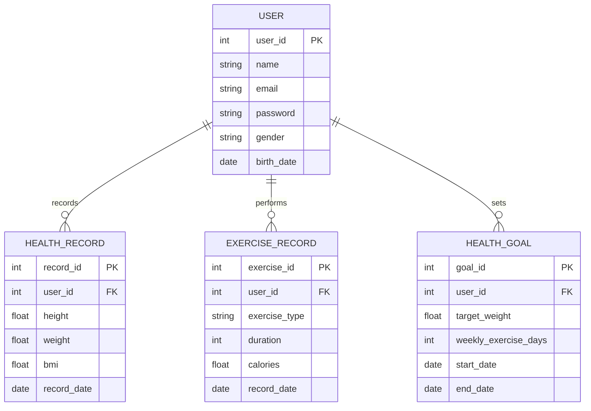

# Entity Relationship Diagram

```mermaid
erDiagram

USER {
    int user_id PK
    string name
    string email
    string password
    string gender
    date birth_date
}

HEALTH_RECORD {
    int record_id PK
    int user_id FK
    float height
    float weight
    float bmi
    date record_date
}

EXERCISE_RECORD {
    int exercise_id PK
    int user_id FK
    string exercise_type
    int duration
    float calories
    date record_date
}

HEALTH_GOAL {
    int goal_id PK
    int user_id FK
    float target_weight
    int weekly_exercise_days
    date start_date
    date end_date
}

USER ||--o{ HEALTH_RECORD : records
USER ||--o{ EXERCISE_RECORD : performs
USER ||--o{ HEALTH_GOAL : sets
```
