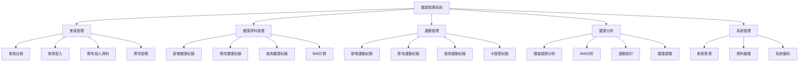

# Functional Decomposition Diagram (FDD)

```mermaid
graph TD
    A[健康管理系統]

    A --> B[會員管理]
    B --> B1[會員註冊]
    B --> B2[會員登入]
    B --> B3[修改個人資料]
    B --> B4[修改密碼]

    A --> C[健康資料管理]
    C --> C1[新增健康紀錄]
    C --> C2[修改健康紀錄]
    C --> C3[查詢健康紀錄]
    C --> C4[BMI計算]

    A --> D[運動管理]
    D --> D1[新增運動紀錄]
    D --> D2[修改運動紀錄]
    D --> D3[查詢運動紀錄]
    D --> D4[卡路里紀錄]

    A --> E[健康分析]
    E --> E1[體重趨勢分析]
    E --> E2[BMI分析]
    E --> E3[運動統計]
    E --> E4[健康建議]

    A --> F[系統管理]
    F --> F1[會員管理]
    F --> F2[資料維護]
    F --> F3[系統備份]
```
