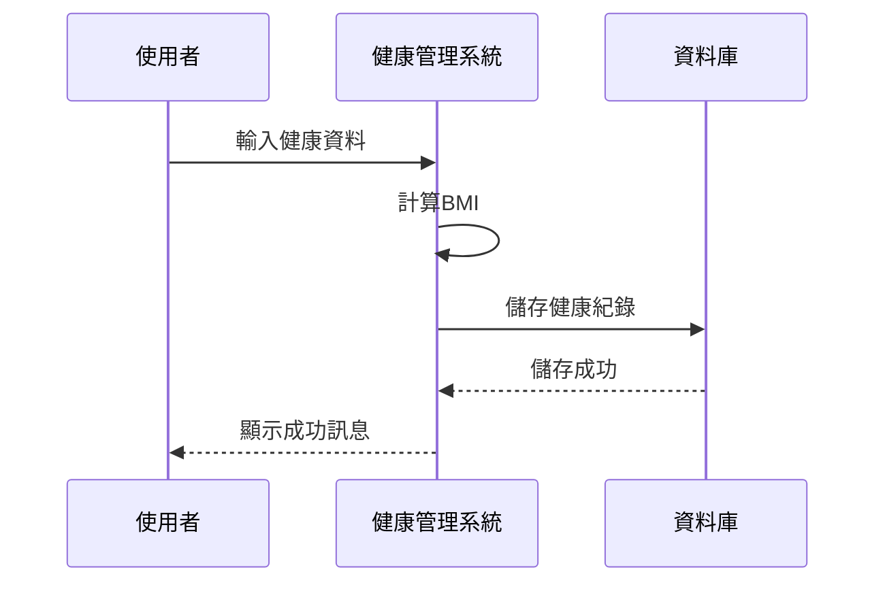

# Add Health Record Sequence Diagram

```mermaid
sequenceDiagram

participant User as 使用者
participant System as 健康管理系統
participant Database as 資料庫

User->>System: 輸入健康資料

System->>System: 計算BMI

System->>Database: 儲存健康紀錄

Database-->>System: 儲存成功

System-->>User: 顯示成功訊息
```
