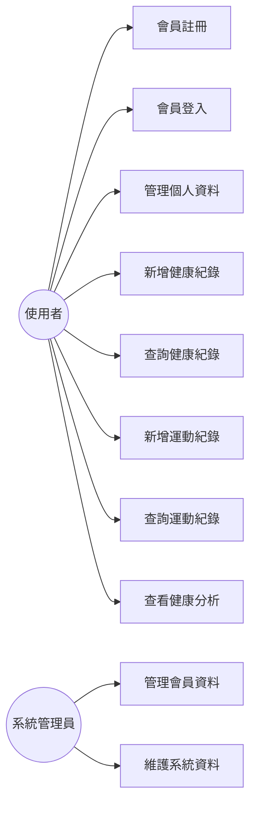

# Use Case Diagram

```mermaid
flowchart LR

User((使用者))
Admin((系統管理員))

UC1[會員註冊]
UC2[會員登入]
UC3[管理個人資料]
UC4[新增健康紀錄]
UC5[查詢健康紀錄]
UC6[新增運動紀錄]
UC7[查詢運動紀錄]
UC8[查看健康分析]

UC9[管理會員資料]
UC10[維護系統資料]

User --> UC1
User --> UC2
User --> UC3
User --> UC4
User --> UC5
User --> UC6
User --> UC7
User --> UC8

Admin --> UC9
Admin --> UC10
```
